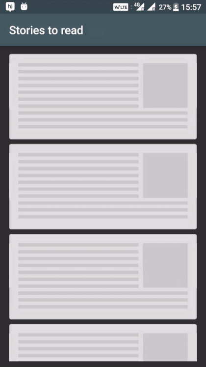
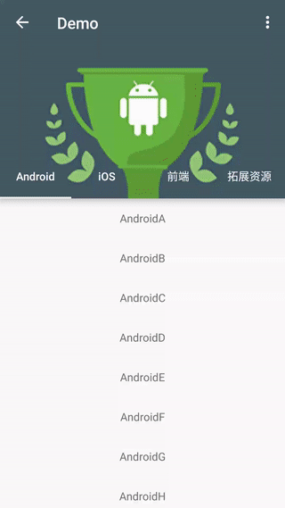

# 实用库集合
## RecyclerView相关
* [控制RecyclerView Item停留位置（居中？左对齐？)](http://www.jianshu.com/p/e86f68e24d8f)
* [预加载视图1](https://github.com/sharish/ShimmerRecyclerView)  
   效果图:  
   
* [预加载视图2](https://github.com/florent37/FiftyShadesOf)
* [RecyclerView分割线](https://github.com/yqritc/RecyclerView-FlexibleDivider)

## 动画相关
* [复杂动画场景](https://github.com/airbnb/lottie-android)
* [为任何drawable添加波浪动画的库](https://github.com/race604/WaveLoading)

## 主题修改相关
* [任何时候用代码动态修改APP的基础颜色配置](https://github.com/garretyoder/Colorful)

## EditText相关
* [输入长度控制](https://github.com/bufferapp/BufferTextInputLayout)

## 弹窗

* [下拉弹窗](https://github.com/Tapadoo/Alerter)

## 自定义控件
* [快速实现TabLayout与CoordinatorLayout相结合](https://github.com/hugeterry/CoordinatorTabLayout)  
效果图:  
	
* [应用角标实现](https://github.com/leolin310148/ShortcutBadger)